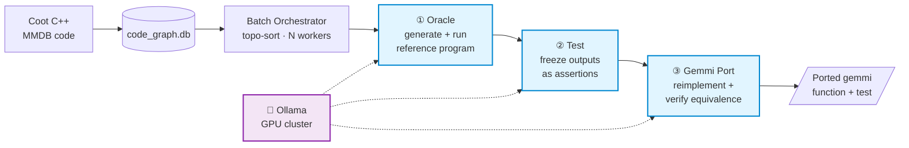
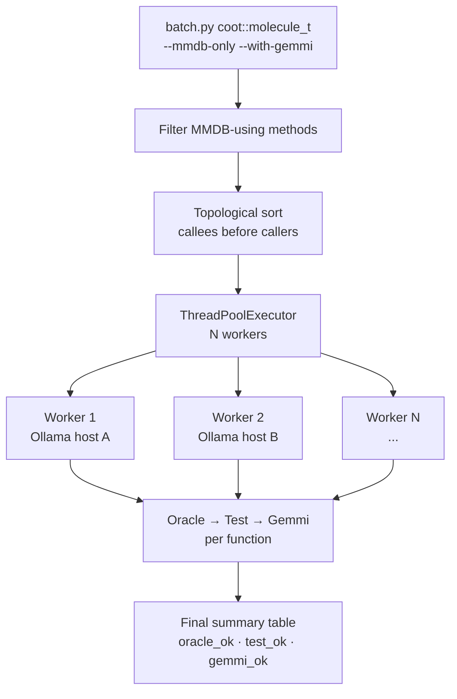
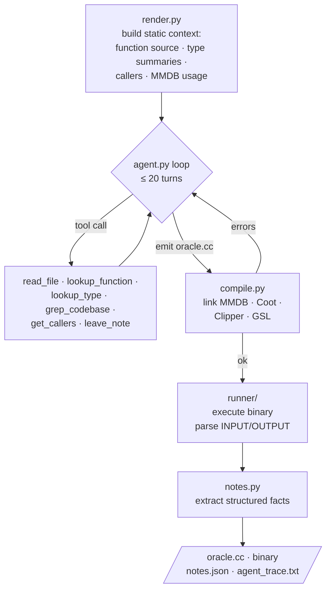
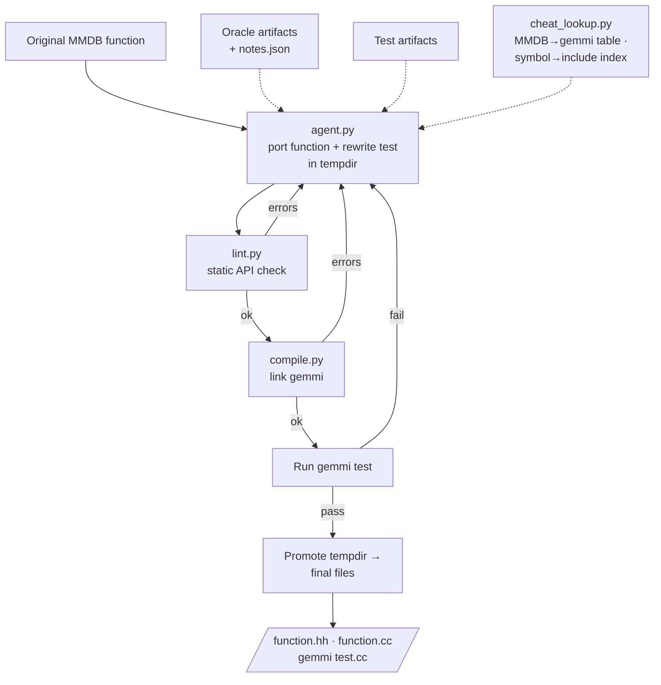

# coot-tooling

An LLM-driven pipeline that automatically ports C++ functions from the [Coot](https://github.com/pemsley/coot) crystallography library away from [MMDB](https://www.ccp4.ac.uk/html/mmdbfaq.html) (legacy molecular data library) to [gemmi](https://gemmi.readthedocs.io/).

## Overview

The pipeline has three agentic stages, each driven by a local LLM (via Ollama or an OpenAI-compatible endpoint):



1. **Oracle** — generates `oracle.cc`, a standalone C++ program that calls the target MMDB function and prints its `INPUT`/`OUTPUT` values, then compiles and runs it to capture ground truth.
2. **Test** — reads the oracle output and converts it into a Google Test suite (`test.cc`), compiled and run to verify assertions pass.
3. **Gemmi** — ports the original MMDB function to a gemmi equivalent (`function.hh` + optional `function.cc`) plus a gemmi-based test, compiled and run to verify correctness.

The backbone is `ast-data/code_graph.db` (SQLite) — it stores every C++ function, type, call-edge, and type-usage relation for the Coot codebase, extracted via libclang.

### Codebase scope

| Entity | Count |
|--------|-------|
| Source files | 2,417 |
| Functions | 30,004 |
| Types | 13,766 |
| Call edges | 162,240 |
| Type-use edges | 22,668 |
| Classes with MMDB usage | 153 |
| Methods with MMDB usage | 1,098 |

## Environment Setup

The pipeline requires a running LLM instance — either Ollama or any OpenAI-compatible server (vLLM, llama.cpp, etc.).

| Variable | Default | Description |
|----------|---------|-------------|
| `OLLAMA_HOSTS` | `http://127.0.0.1:11434,http://127.0.0.1:11435` | Comma-separated Ollama endpoints; workers are round-robin assigned |
| `CT_BACKEND` | `ollama` | Set to `openai` to use an OpenAI-compatible backend instead |
| `OPENAI_HOSTS` | — | Comma-separated base URLs for OpenAI-compatible endpoints (required when `CT_BACKEND=openai`) |
| `CT_LLM_TIMEOUT` | `300` | Max wall-clock seconds per LLM call before retry |
| `CT_LLM_MAX_RETRIES` | `2` | Number of retries on timeout or transient failure |

```bash
source .venv/bin/activate

# Ollama (default)
OLLAMA_HOSTS=http://127.0.0.1:11434 python -m tooling.batch "coot::molecule_t" --agent

# OpenAI-compatible (e.g. vLLM)
CT_BACKEND=openai OPENAI_HOSTS=http://127.0.0.1:8001/v1 python -m tooling.batch "coot::molecule_t" --agent
```

## Core Commands

### Run the full pipeline (batch)

```bash
# All MMDB-using methods in a class, all three stages, 2 workers
python -m tooling.batch "coot::molecule_t" --agent --mmdb-only --with-gemmi --workers 2

# Filter to methods whose name contains a substring
python -m tooling.batch "coot::molecule_t" --agent --filter cid

# Include dependency functions in topological order
python -m tooling.batch "coot::molecule_t" --agent --with-deps --workers 4

# All functions in a source file
python -m tooling.batch_file src/coot/molecule.cc --agent --workers 4

# List matching functions without generating
python -m tooling.batch "coot::molecule_t" --list

# Retry previously failed functions only
python -m tooling.batch "coot::molecule_t" --retry-failed
```

### Run a single function through individual stages

```bash
# Oracle only
python -m tooling.oracle.generate "coot::molecule_t::get_bonds_mesh"

# Test only (requires oracle output dir)
python -m tooling.test generated-tests/coot__molecule_t__get_bonds_mesh/

# Gemmi port only (requires oracle + test output)
python -m tooling.gemmi generated-tests/coot__molecule_t__get_bonds_mesh/ \
    "coot::molecule_t::get_bonds_mesh"
```

### Evaluate agent traces

```bash
# Evaluate a single function directory (auto-detects first failing stage)
python -m tooling.evaluate generated-tests/coot__util__number_of_residues_in_molecule

# Evaluate all function directories in parallel
python -m tooling.evaluate generated-tests/ --all --workers 4 --skip-existing
```

### Database rebuild

```bash
# Parse Coot C++ source and build code_graph.db (run from repo root, venv active)
python ast-script/extract_graph.py

# Generate LLM doc summaries for functions
python ast-script/summarise_functions.py

# Interactive DB query shell
python ast-script/query.py
```

## Output Layout

Each function gets a directory under `generated-tests/<sanitized_qname>/`:

```
generated-tests/coot__molecule_t__foo/
  oracle/
    oracle.cc          # generated oracle program
    oracle             # compiled binary
    compile.sh
    compile.log
    agent_trace.txt    # full LLM tool-call trace (primary debug artifact)
    notes.json         # structured facts for downstream agents
  test/
    test.cc
    test_check         # compiled test binary
    compile.sh
    agent_trace.txt
  gemmi/
    function.hh        # ported gemmi function header
    function.cc        # optional implementation file
    test.cc            # gemmi-based test
    compile.sh
    compile.log
    agent_trace.txt
    original.cc        # copy of the original MMDB source
```

The batch runner considers a function "complete" when `gemmi/function.hh` and `gemmi/test.cc` both exist. Re-running skips complete functions unless `--force` is passed.

## Architecture

### Batch orchestrator



### Oracle stage



### Gemmi port stage



### Module reference

| Module | Purpose |
|--------|---------|
| `tooling/db.py` | Database access layer — `connect()`, `get_function`, `get_class_functions`, `get_internal_call_deps`, etc. |
| `tooling/oracle/render.py` | Builds static context prompt from DB rows (source, type summaries, callers, MMDB usage) |
| `tooling/oracle/agent.py` | Agentic oracle loop with degenerate-thinking detection, nudge injection, and rescue prompt |
| `tooling/oracle/compile.py` | Compiler flags and library paths for MMDB/Coot/Clipper/GSL linkage |
| `tooling/oracle/notes.py` | Post-oracle pass: extracts structured JSON facts into `notes.json` |
| `tooling/oracle/overrides/` | Curated `.cc` snippets for constructing specific receiver types (e.g. `coot::molecule_t`) |
| `tooling/test/agent.py` | Test generation loop; oracle stdout is frozen ground truth |
| `tooling/gemmi/agent.py` | Combined port: produces `function.hh`/`function.cc` + `test.cc` in a temp dir before promoting |
| `tooling/gemmi/lint.py` | Static pre-compile linter catching recurring gemmi API mistakes |
| `tooling/gemmi/cheat_lookup.py` | Curated MMDB→gemmi method translation table and symbol→include index |
| `tooling/gemmi/aggregate.py` | Merges per-function headers into a single compilable `_aggregated/` pair |
| `tooling/llm.py` | LLM backend abstraction (Ollama + OpenAI-compatible); timeout/retry handling |
| `tooling/ollama.py` | Thread-local host management; round-robin assignment from `OLLAMA_HOSTS` |
| `tooling/batch.py` | Class-level orchestrator with topological sort and worker pool |
| `tooling/batch_file.py` | File-level orchestrator |
| `tooling/evaluate/` | LLM-based evaluator for agent traces; `--all` mode for bulk evaluation |
| `ast-script/extract_graph.py` | libclang AST walker that populates `code_graph.db` |
| `ast-script/summarise_functions.py` | Adds LLM-generated doc summaries to the DB |

## Agent Behaviour

Each agent loop (oracle / test / gemmi) shares the same structure:

- Up to 20 turns of tool calls, then an extension offer for up to `_EXTENSION_TURNS` more.
- A nudge message injected every `NUDGE_EVERY_N_TURNS` turns reminding the model of the required output format.
- A `NO_COMPILE_AFTER` threshold: if the model hasn't attempted a compile by that turn, an urgent warning fires.
- Degenerate-thinking detection aborts the loop early if the model is stuck in a repetitive pattern; a rescue prompt then asks for a best-effort plain-text output.
- Tool results are cached within a session (keyed by name + args) to avoid burning tokens on repeated identical lookups. `compile_*`, `run_*`, and `leave_note` are excluded from the cache.
- The `leave_note` tool lets the oracle agent persist facts into `notes.json` mid-session; downstream agents receive these as validated context.

## Key Constants

| Constant | Location | Value |
|----------|----------|-------|
| `PROJECT_ROOT` | `tooling/db.py` | `/lmb/home/jdialpuri/Development/coot-dev/coot` |
| `OUT_ROOT` | `tooling/oracle/generate.py` | `generated-tests/` |
| `DEFAULT_MODEL` | `tooling/oracle/generate.py`, `tooling/gemmi/generate.py` | `qwen3.6` |
| Autobuild prefix | `tooling/oracle/compile.py`, `tooling/test/compile.py` | `/lmb/home/jdialpuri/autobuild/Linux-hal.lmb.internal/` |

Override the model with `--model <name>` on any batch or generate command.

## Known Caveats

- **`GetSeqNum()` vs `GetResidueNo()`** — oracles must use `GetSeqNum()` for PDB residue numbers; `GetResidueNo()` returns the chain-local index (0-based).
- **Insertion codes** — MMDB uses `""` for no insertion code; gemmi uses `' '` (space). Always normalize before comparing.
